# The Writers Workbench — Production User Manual

> **Audience:** Writers using the production web app at  
> **https://writersworkbench-production.up.railway.app**
>
> **What this manual covers:** Every screen, button, panel, dialog, sidebar item, keyboard shortcut, and dropdown in the live production UI — plus how to talk to **Eve** (your voice agent) and how to use the **Chat drawer** to drive the system without using the UI at all.
>
> **What this manual does *not* cover:** Dev-only features, sprint roadmap items, or anything not yet released.

---

## Quick Reference

| Need to... | Go to / Do |
|---|---|
| Log in | `/login` (auto-redirect from any page) |
| See everything at a glance | **Dashboard** (`/`) |
| Open a book or story | **My Projects → [project name]** |
| Read or edit a chapter | **Content Library → click row** |
| Browse research reports | **Reference → Research** |
| Check my spend | **Reference → Cost Tracking** |
| Recover something I deleted | **Trash** (sidebar bottom) |
| Change my name, password, or theme | **Settings** |
| Talk to Eve | Click **Talk to Eve** in sidebar (bottom) |
| Type a command instead of speaking | Click the **chat icon** in the top bar |
| Search across everything | **Cmd/Ctrl + K** |
| Save the chapter you're editing | **Cmd/Ctrl + S** (auto-save also runs) |

---

## Table of Contents

1. [Getting Started](#1-getting-started)
2. [The Login & Signup Pages](#2-the-login--signup-pages)
3. [The First-Time Onboarding Tutorial](#3-the-first-time-onboarding-tutorial)
4. [Layout Overview](#4-layout-overview-sidebar--top-bar)
5. [The Dashboard](#5-the-dashboard)
6. [My Projects](#6-my-projects)
7. [The Project Workspace (the 9 Tabs)](#7-the-project-workspace-the-9-tabs)
8. [The Content Library](#8-the-content-library)
9. [The Content Editor](#9-the-content-editor-tiptap)
10. [Brainstorm](#10-brainstorm)
11. [Outlines](#11-outlines)
12. [Reference: Genres](#12-reference-genres)
13. [Reference: Story Arcs](#13-reference-story-arcs)
14. [Reference: Research](#14-reference-research)
15. [Reference: Sources](#15-reference-sources)
16. [Reference: Cost Tracking](#16-reference-cost-tracking)
17. [Trash & Restore](#17-trash--restore)
18. [Settings](#18-settings)
19. [Admin Panel](#19-admin-panel-admin-only)
20. [Chat with Eve (text-based)](#20-chat-with-eve-the-text-based-chat-drawer)
21. [Eve — The Voice Agent](#21-eve--the-voice-agent)
22. [Eve Commands — Full Reference (Voice **and** Chat with Eve)](#22-eve-commands--full-reference-voice-and-chat-with-eve)
23. [Keyboard Shortcuts](#23-keyboard-shortcuts)
24. [Troubleshooting](#24-troubleshooting)
25. [Account, Billing & Account Deletion](#25-account-billing--account-deletion)

---

## 1. Getting Started

The Writers Workbench is your **dashboard** for managing AI-written books, stories, blog posts, and newsletters. The system has two ways to give it instructions:

- **Eve (voice)** — click "Talk to Eve" in the sidebar and speak naturally.
- **Chat drawer (text)** — click the chat icon in the top bar and type.

The UI itself is for **viewing, editing, organizing, approving, and publishing** content. You will not find a "New Project" button anywhere — projects are created by asking Eve or the chat to brainstorm one.

> **About the Newsletter sidebar item.** You may notice a **Newsletter** entry in the sidebar that doesn't lead to any active screens yet. The full **Newsletter Agent** (ingestion, draft, review, scheduled send) is shipping in the next release. Until then, the entry is a placeholder, and the **RSS Feed URLs** field on the Genres screen (§12) is where you can pre-populate discovery sources so they're ready when the pipeline goes live. Existing newsletters generated by the prior V1 pipeline still appear in the Content Library and can be edited and emailed normally — only the newsletter *creation/scheduling UI* is pending.

### Production URL

```
https://writersworkbench-production.up.railway.app
```

### Browser Requirements

- Chrome, Edge, Safari, or Firefox (latest two major versions)
- Microphone access (only required for Eve voice mode)
- Allow pop-ups from the production domain (for the .docx export download)

---

## 2. The Login & Signup Pages

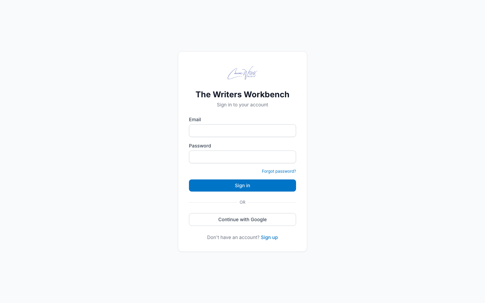

### Login (`/login`)

1. Enter your **email** and **password**.
2. Click **Sign In**.
3. Or click **Continue with Google** to sign in with your Google account.

If you forget your password, click **Forgot password?** at the bottom of the form. You'll receive a password-reset email.

### Signup (`/signup`)

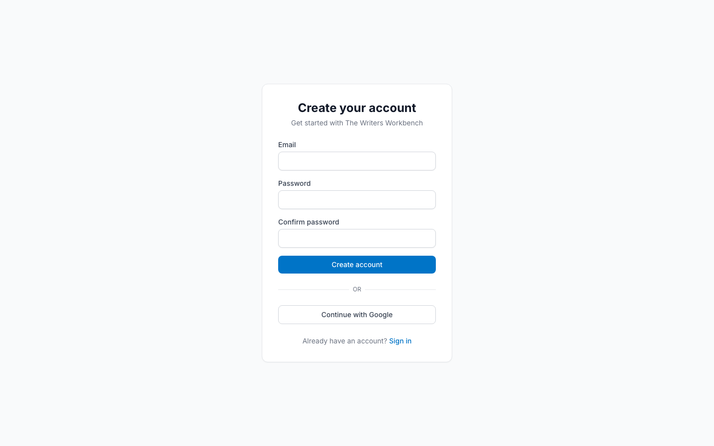

New users:

1. Enter your **email**, choose a **password** (8+ characters), and click **Create Account**.
2. Check your inbox for a verification link.
3. Once verified, you'll land on the **Onboarding** page (next section).

### Forgot Password (`/forgot-password`)

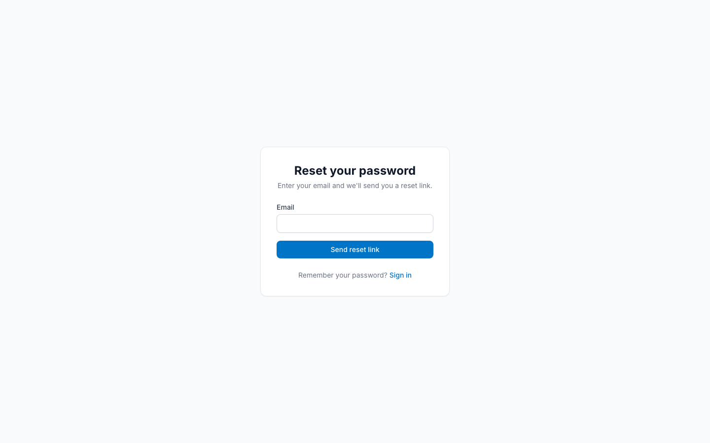

Enter your email, click **Send Reset Link**, then check your email and click the link to reach the **Reset Password** page.

### Reset Password (`/reset-password`)

Enter and confirm your new password, then click **Update Password**. You'll be returned to the dashboard automatically signed in.

---

## 3. The First-Time Onboarding Tutorial

The first time you log in, a 5-step modal overlay appears:

1. **Welcome** — what the Writers Workbench does.
2. **The Sidebar** — navigation overview.
3. **Eve** — how to talk to your voice agent.
4. **Chat** — how to type commands.
5. **Your First Project** — how to brainstorm a book.

Click **Next** to advance, **Skip** to dismiss. You can replay it any time from **Settings → Help → Replay Tutorial**.

---

## 4. Layout Overview (Sidebar + Top Bar)

Every page is wrapped in the **AppShell**, which has three regions:

```
┌──────────┬───────────────────────────────────────┐
│ Sidebar  │  Top Bar (breadcrumb · search · 🔔)  │
│          ├───────────────────────────────────────┤
│ Nav      │                                       │
│          │   Page content                        │
│          │                                       │
│ Eve      │                                       │
│ Trash    │                                       │
│ Settings │                                       │
└──────────┴───────────────────────────────────────┘
```

### The Sidebar

- **Collapse / expand** — click the chevron at the top of the sidebar to shrink it to icons only. Useful on smaller screens.
- **Dashboard** — overview of everything.
- **My Projects** *(expandable)* — your books and long-form projects. The number badge shows how many active projects you have. Click a project name to open its workspace. A small colored dot indicates project status:
  - 🔵 in progress · 🟢 published · ⚪ draft · 🟡 scheduled · 🔴 rejected
- **Content Library** — every chapter, blog post, newsletter, and short story.
- **Brainstorm** — open the brainstorming form to generate a new story outline.
- **Outlines** — list of every saved outline.
- **Reference** *(collapsible)*:
  - **Genres** — manage your writing genres and RSS feeds.
  - **Story Arcs** — browse / create story-structure templates.
  - **Research** — saved research reports.
  - **Sources** — articles indexed by genre.
  - **Cost Tracking** — token usage and spend.
- **Talk to Eve** — opens the voice widget popover (see §21).
- **Trash** — soft-deleted items, restorable for 30 days.
- **Settings** — account, theme, password, account deletion.
- **Admin** — only visible if you are an admin.

### The Top Bar

- **Breadcrumb** — clickable path showing where you are. Entity titles (project names, chapter titles) are resolved live.
- **Search bar** — global search across projects, content, research. **Cmd/Ctrl + K** focuses it from anywhere. Results show a type icon; click to navigate.
- **Theme toggle** — sun/moon icon switches between light and dark mode.
- **Chat icon** — opens the Chat drawer (see §20).

---

## 5. The Dashboard

URL: **`/`**


Shows everything at a glance.

### Summary Cards (top)

- **Projects** — total active projects.
- **Chapters** — total written chapters.
- **Short Stories** — total short stories.
- **Blog Posts** — total blog posts.
- **Newsletters** — total newsletters.
- **Research Reports** — total saved reports.

Each card is **clickable** and navigates to that section's filtered list. Auto-refreshes every 30 seconds.

### Recent Activity Table (below cards)

A live-updating list of the most recent items across all content types. Columns:

- **Title** — click to open.
- **Type** — color-coded badge.
- **Status** — with a status icon (✓ published, 🕐 scheduled, ✗ rejected, ✎ draft).
- **Updated** — relative time.

Use **Tab** + **Enter** to navigate without a mouse — every row is keyboard-focusable.

---

## 6. My Projects

URL: **`/projects`**

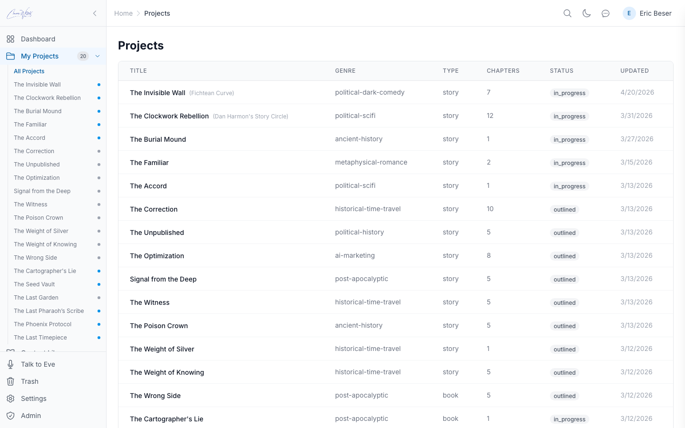

### List View

A paginated table of all your projects. Columns: **Title**, **Genre**, **Chapters**, **Status**, **Updated**. Default page size is 25.

- Click any row to open the **Project Workspace**.
- Use the **Pagination** bar at the bottom: page numbers, prev/next, and page-size selector (10 / 25 / 50 / 100).

### Empty State

If you have no projects yet, you'll see "No projects yet" with guidance to **brainstorm** one via Eve or chat.

---

## 7. The Project Workspace (the 9 Tabs)

URL: **`/projects/:id`** (with `?tab=` parameter)

When you open a project, the page is organized into **9 tabs**. The active tab is preserved in the URL so you can bookmark or share a deep link.

### Header

- **Project title** + **status badge**.
- **Edit button** (pencil icon) — opens the **Project Edit Form** to change title, genre (dropdown of your genres), status, and project type.
- **Delete button** (trash icon) — soft-deletes the project. A confirmation dialog shows a **cascade impact** (how many chapters, story-bible entries, etc. will go to trash with it).

### Tab 1 — Overview

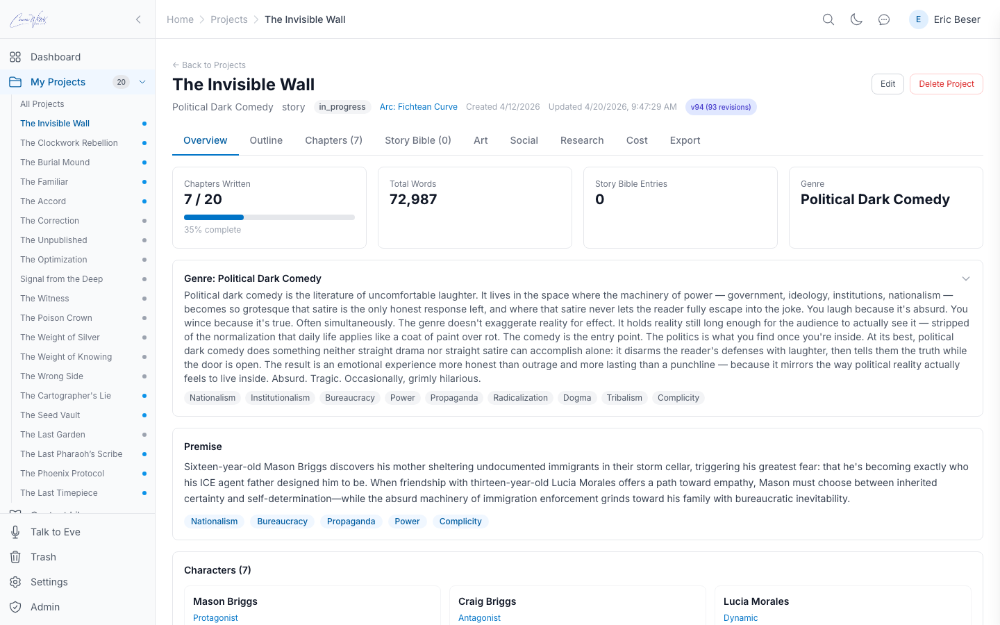

- **Progress bar** — written chapters / total chapters from outline.
- **Word count** — total across all chapters.
- **Premise** & **Themes** — from the outline.
- **Character cards** — each main character with name, role, brief.
- **Genre badge** — clickable, opens the genre's reference page.

### Tab 2 — Outline

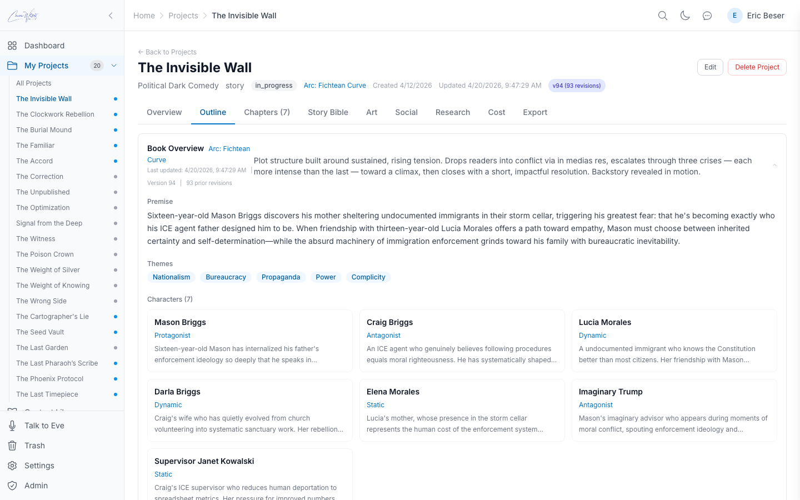

- Chapter list with **sub-chapter outlines** (when generated by `brainstorm_chapter`).
- **Story arc** name and a brief description (if set).
- **Outline version info** — total versions saved, latest version number, last revision note.
- **Written-chapter indicators** — chapters that already have content show a checkmark.

### Tab 3 — Chapters

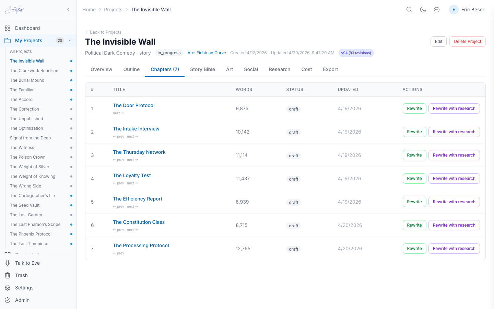

- Sortable table: **Number**, **Title**, **Word Count**, **Status**, **Updated**.
- Click any row to open the chapter in the **Content Editor**.
- Tab title shows count: "Chapters (12)".
- Use **prev/next** buttons inside the editor to move between chapters.

### Tab 4 — Bible (Story Bible)

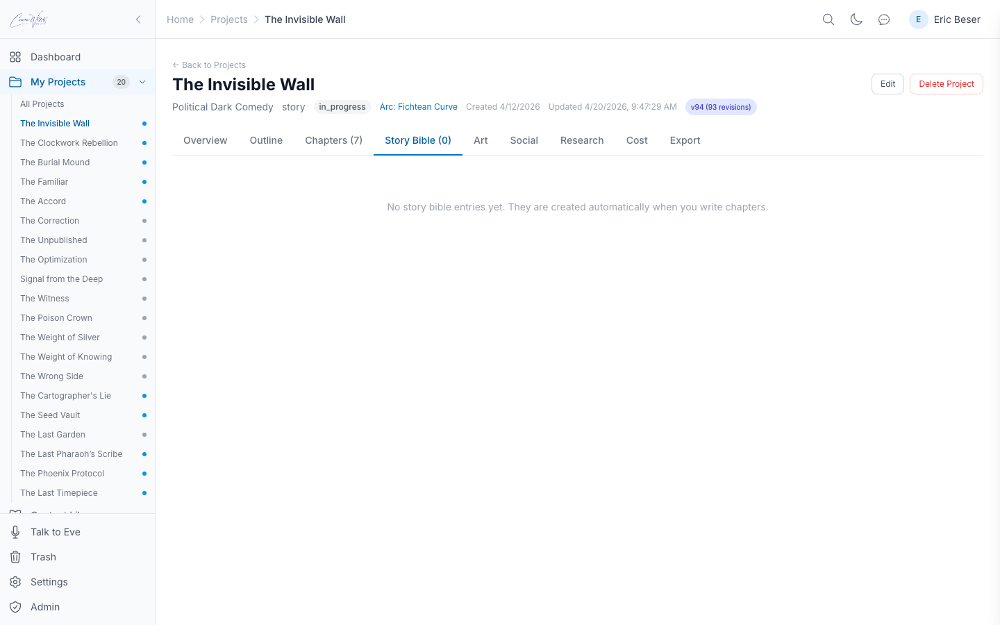

- All entries grouped by **type**: character, event, location, plot_thread, world_rule, timeline.
- **+ Add Entry** button opens the entry form.
- **Edit** (pencil) on each entry.
- **Delete** (trash) on each entry — soft delete with confirmation.
- Tab title shows count: "Bible (24)".

### Tab 5 — Art

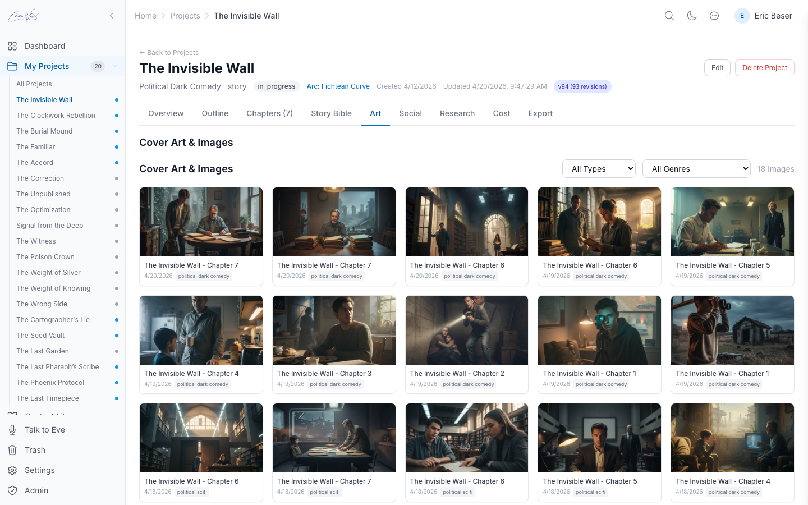

- **Image gallery** — every cover-art image generated for this project.
- Filter by **type** (cover, scene, illustration) and **genre**.
- Click an image to open a full-size modal with **Download** button.
- The "Set as cover" option appears when picking from a chapter's cover-image picker.

### Tab 6 — Social

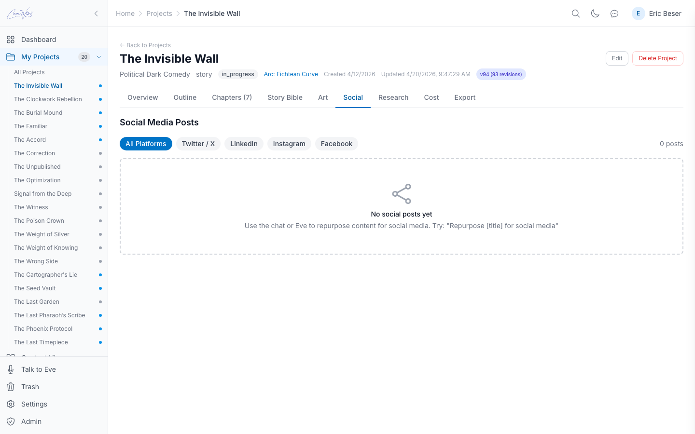

- All social posts generated for this project.
- **Platform tabs**: All / Twitter / LinkedIn / Instagram / Facebook.
- Each post card shows: platform badge, post text, hashtags, image thumbnail, status badge.
- **Copy** button copies the post text to clipboard.

### Tab 7 — Research

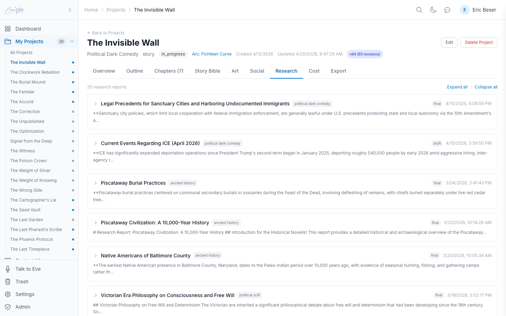

- All research reports filtered to this project's genre.
- Click any report to open the **Research Detail** page.

### Tab 8 — Cost

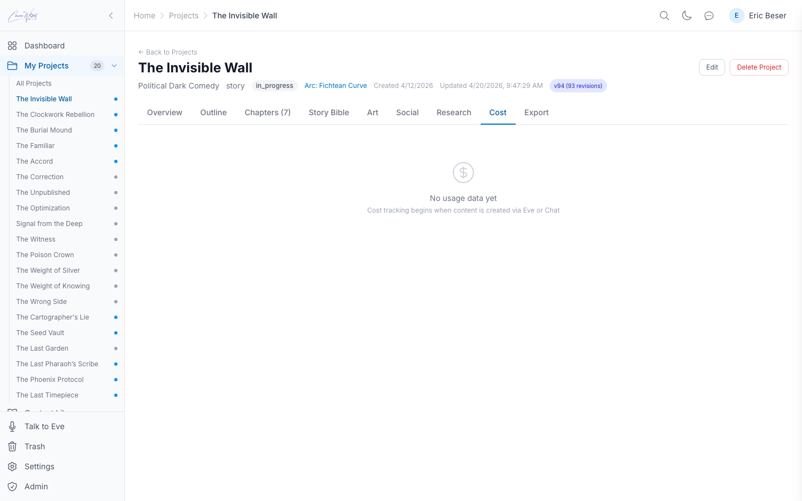

- Embedded **Cost Dashboard** scoped to this project only.
- Date-range filter (7d / 30d / 90d / all).
- Total cost, token count, API call count summary cards.
- Daily cost bar chart.
- Breakdown table by model and by workflow.

### Tab 9 — Export

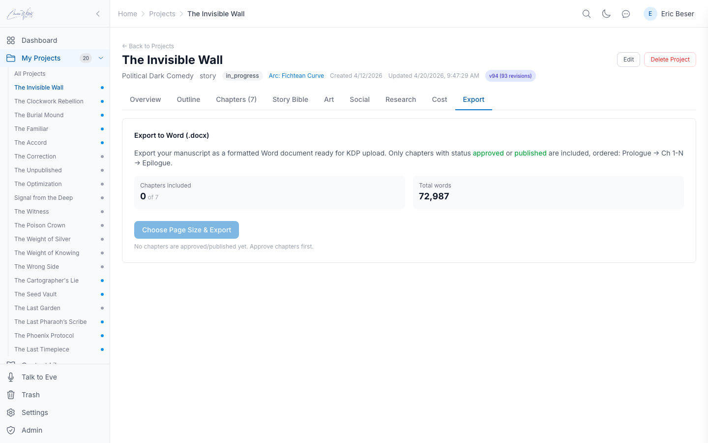

- **Exportable chapter count** and **total word count**.
- **Page size selector** (5×8, 5.5×8.5, 6×9, 8.5×11, etc).
- **Export to .docx** button generates a KDP-ready manuscript and downloads it.

---

## 8. The Content Library

URL: **`/library`** (also accessible as `/chapters`, `/short-stories`, `/blog-posts`, `/newsletters` — all redirect here with the appropriate filter)


The unified view of every piece of writable content. Filter by type to see only chapters, short stories, blog posts, or newsletters:

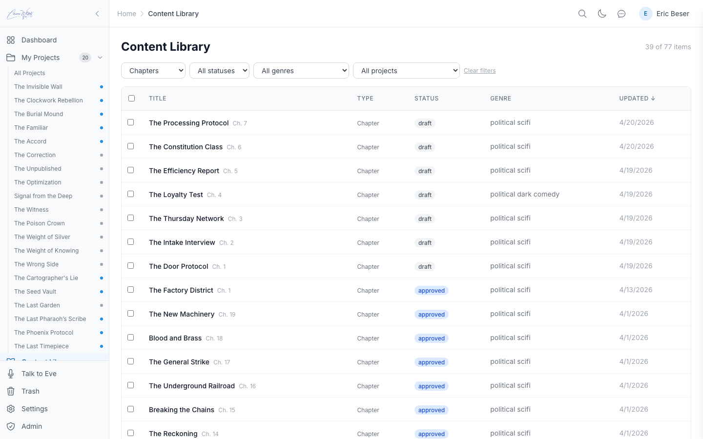

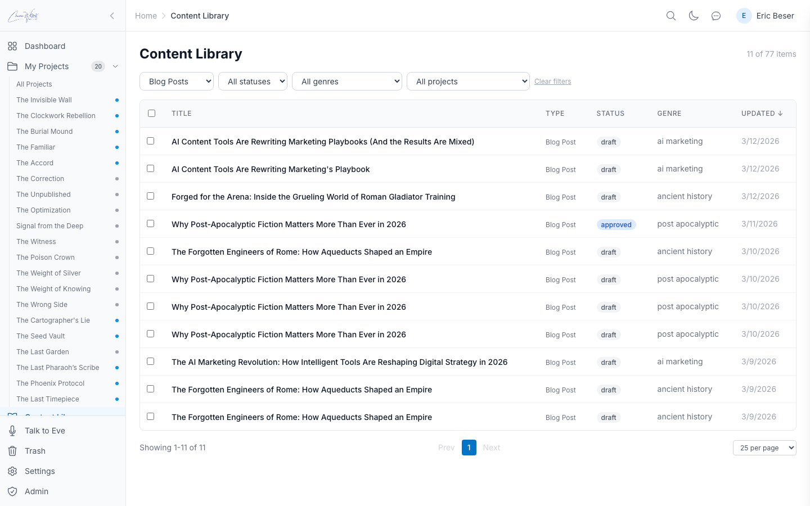

### Filter Bar (top)

- **Type** dropdown: All / Chapter / Short Story / Blog Post / Newsletter.
- **Status** dropdown: All / Draft / Approved / Published / Scheduled / Rejected.
- **Genre** dropdown.
- **Project** dropdown.

The URL syncs with filters: `?type=chapter&status=draft`.

### Table

Columns: **Title**, **Type**, **Project**, **Genre**, **Status**, **Word Count**, **Updated**.

- All columns are **sortable** — click the header.
- Each row has a **checkbox** (left) for bulk selection.
- Click anywhere else in the row to open the content.

### Bulk Actions (appear when one or more rows are selected)

- **Approve** — sets status to `approved`.
- **Publish** — sets status to `published` (also creates a version snapshot).
- **Delete** — soft-deletes (moves to Trash).

### Pagination

Default 25 per page; selector for 10 / 25 / 50 / 100.

---

## 9. The Content Editor (TipTap)

URL: **`/content/:id`**

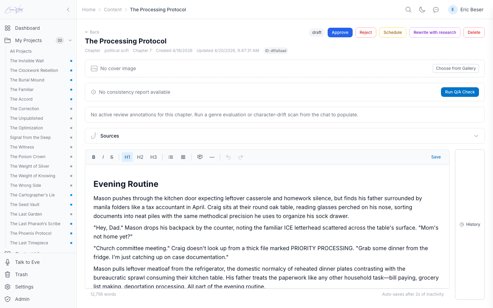

Open any chapter, story, blog post, or newsletter to edit it.

### Toolbar (top)

- **Bold**, **Italic**, **Strikethrough**, **Inline code**
- **Heading levels** (H1, H2, H3)
- **Bullet list**, **Numbered list**, **Block quote**
- **Insert link** (URL prompt)
- **Undo** / **Redo**

### Cover Image Banner (above title, chapters only)

- Shows the project's cover art if one is set.
- **Change Cover** button → opens the Image Gallery picker (pick from any image generated for this project).
- **Remove** clears the cover.
- If no image set, click **Choose from Gallery**.

### Title

Editable inline; click the title to rename.

### Status Controls (top-right)

- **Status badge** — current status with icon.
- **Approve** button (visible on draft).
- **Publish** button (visible on approved).
- **Reject** button (visible on draft / approved).
- **Schedule** button (visible on draft / approved) → date/time picker. Sets `status='scheduled'` and the cron will publish at the chosen time. **Unschedule** clears it.

### Auto-save

The editor auto-saves every change after a short debounce (no Save button required).  
Press **Cmd/Ctrl + S** to force an immediate save.  
A subtle "Saved" indicator appears top-right after each save.

### Unsaved Changes Warning

If you try to close the tab or navigate away with unsaved changes, you'll get a confirmation prompt.

### Right-Side Panels (collapsible, chapters only)

- **Q/A Consistency Report** — 9 automated checks run after each chapter is written. Each shows ✓ PASS or ⚠ NEEDS_REVIEW. Pass count badge and generated timestamp.
- **Sources / Provenance** — research articles cited while writing this content. Each row: title, type badge, scrape date, external link.
- **Version History** — every saved version. Click to **view**, **compare** (diff visualization), or **restore** an older version.

### Delete

The **Delete** button at the bottom of the page soft-deletes the content. Cascade info is shown in the confirmation.

---

## 10. Brainstorm

URL: **`/brainstorm`**

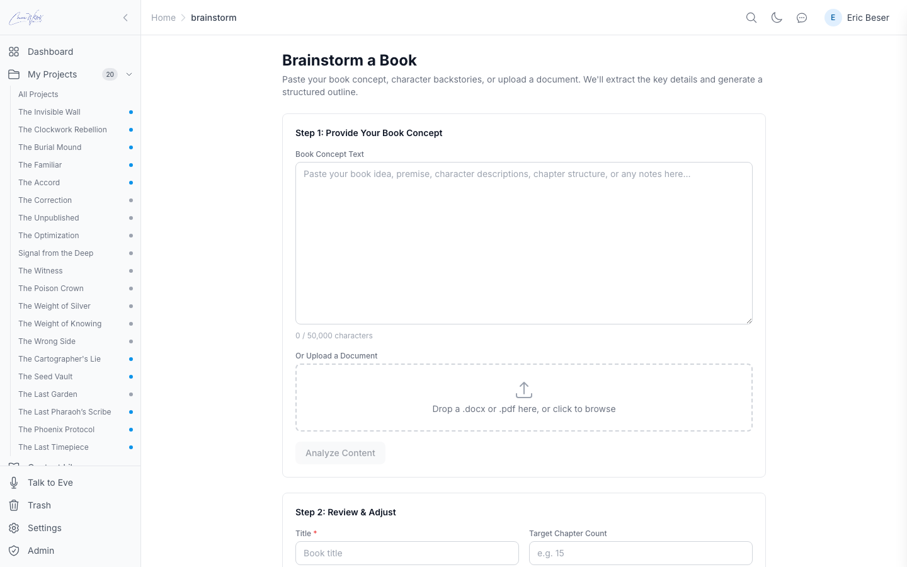

This is **how new projects are born.** Brainstorm takes a rough premise (or even just a tone + topic) and turns it into a full chapter-by-chapter outline saved as a new project. After you submit, the system:

1. Sends the request to the writing engine.
2. Returns an **acknowledgement** within a couple of seconds: *"Working on it — you'll get an email when it's ready."*
3. Runs the brainstorm in the background (typically 60–120 seconds).
4. Drops the finished outline into **My Projects → [your title]** and emails you a copy.

The form has three steps. We'll walk through each with a sample project — *Term Limits*, a fictional political-comedy novel — so you can see exactly what to type and why.

> **Tip:** If the genre or story arc you want isn't in the dropdown, create it first in **Reference → Genres** (§12) or **Reference → Story Arcs** (§13). The Brainstorm form only lists genres and arcs that already exist.

### Step 1 — Tell the system what the book is about

Two ways to start: paste text, or upload a document. **Pick one** — they're alternatives, not both.

#### Book Concept Text (textarea, up to 50,000 chars)

Paste anything you have about the book: premise, character notes, a few chapter ideas, scraps from a brainstorming session, even a synopsis of a similar book you want to riff on. The brainstorm engine reads all of it.

**What to put here:**

- **Premise** (1–3 sentences): the central conflict, in plain English.
- **Main characters** (3–5): name, role, one-line description.
- **Tone / influences**: what existing book or show is this in conversation with?
- **Suggested chapter structure** (optional): if you already know the beats.

**What NOT to put here:**

- Long Wikipedia-style backstory (the brainstorm doesn't need lore — it needs structure).
- Real people you know (the system will lift names verbatim into the outline).
- Existing copyrighted prose. Paraphrase it.

**Example for *Term Limits* (political comedy):**

```
Title: Term Limits

Premise: When a populist senator dies mid-vote, his estranged daughter — a stand-up
comedian who has spent a decade roasting him from a Brooklyn basement — is appointed
to fill his seat. Sworn in on a Tuesday, she discovers by Friday that her late father
had been blackmailing the Speaker of the House for fifteen years, and the leverage now
sits in a manila folder in her freshman office.

Main characters:
- Joey "JoJo" Halloran — 34, comedian, the new senator. Sharp, unimpressed, allergic
  to scripts.
- Speaker Margaret Vance — 61, calculating, has spent two decades being the smartest
  person in every room except her therapist's.
- Chief of Staff Wendell — 52, inherited from her father, knows where every body is
  buried and which of them are still breathing.
- Press Secretary Imani — 28, a former White House intern who treats the briefing
  room like a venue.

Tone: dry political satire in the tradition of Veep and Thank You for Smoking — not
mean, just unflinching. Comedy of competence and incompetence in equal measure.

Suggested chapter structure: 12 chapters covering swearing-in, discovery of the folder,
first leverage play, media leak, Speaker's counterattack, family revelation, midterm
election, climax in the Senate cloakroom.
```

#### Or Upload a Document

Drag a `.docx` or `.pdf` into the dashed area, or click to browse. The system runs the same parser that reads chapter uploads (under the hood it pulls plain text, drops formatting, then feeds it to the same Step-2 extractor).

Use this when your premise lives in a Word document already, or when a writing partner emailed you a treatment.

**Click "Analyze Content"** — the system pulls candidate values for the Step-2 fields out of your text. If anything looks wrong, you can override it in Step 2 before submitting.

### Step 2 — Review & Adjust

Once you've pasted text or uploaded a file (and clicked Analyze Content), the four review fields populate. You can edit any of them before submitting.

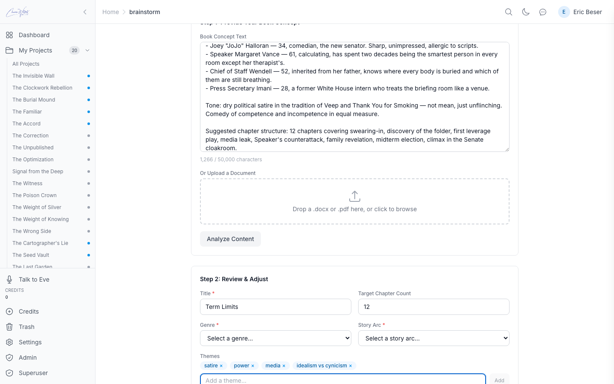

| Field | Required? | What to put here |
|---|---|---|
| **Title** | ✅ | The book's working title. Will become the project name. Renameable later from the project workspace. |
| **Target Chapter Count** | optional | Integer, 1–100. Defaults to 12 if blank. The brainstorm engine uses this as a target, not a hard cap — it may produce a Prologue (chapter 0) and/or Epilogue (chapter N+1) on top. |
| **Genre** | ✅ | Pick from the dropdown. Genres are managed in **Reference → Genres** (§12). The brainstorm engine reads the genre's writing guidelines, sample sources, and style cues to shape the outline. If you don't see your genre, [create it first](#12-reference-genres). |
| **Story Arc** | ✅ | Pick from the dropdown. Story arcs are skeletal narrative frameworks — Three-Act Structure, Hero's Journey, Freytag's Pyramid, Kishōtenketsu, etc. Managed in **Reference → Story Arcs** (§13). Each arc imposes a structure on the chapter beats; you can override it later by re-brainstorming. |
| **Themes** | optional | Type a theme, press **Enter** (or click **Add**). Each theme becomes a chip you can dismiss with the × button. Themes are signals to the writer about what the book is *really about* underneath the plot — power, idealism vs cynicism, grief, etc. The brainstorm uses them to weave subtext into chapter summaries. |

**Themes for *Term Limits*:** `satire` `power` `media` `idealism vs cynicism`

The chips at the bottom of the screenshot show all four added. Themes don't have a hard limit, but 3–6 keeps the outline focused.

### Step 3 — Submit Brainstorm

Click the **Brainstorm** button at the bottom. You'll get a green toast: *"Command sent — results will appear in your Content Library."* The form clears.

Behind the scenes:

1. The writing engine validates the inputs and resolves the genre + story arc.
2. It runs research on the genre/topic to gather discovery material.
3. It generates a chapter outline using the writing prime directive, the genre's writing guidelines, the chosen story arc structure, and your concept text.
4. It saves the new project, attaches the outline, and emails you the rendered HTML.
5. The Content Library and **My Projects** sidebar refresh automatically.

If you don't see the email within 3 minutes, check **Reference → Cost Tracking** (§16) — failed brainstorms still log a cost row with an error in the description column. Common causes: invalid genre, story arc not found, or a transient model rate limit.

> **Want to revise an existing outline instead of starting fresh?** Don't use Brainstorm for that — use **Chat with Eve** (§20) or **Talk to Eve** (§21) and say *"revise the outline for `[title]` to add a prologue"* / *"change JoJo's age to 38"*. Re-brainstorming creates a new project; revision edits the one you have and version-snapshots the previous outline.

---

## 11. Outlines

URL: **`/outlines`**

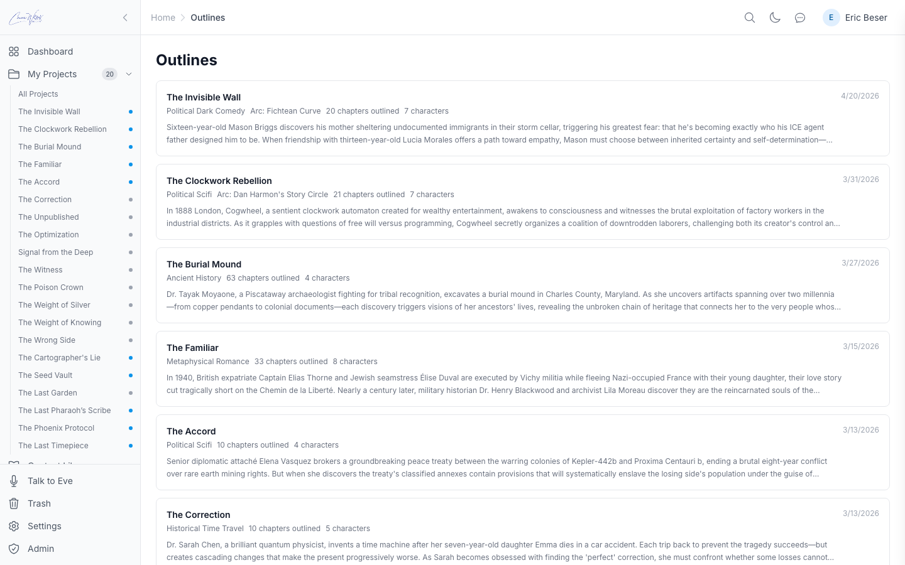

A list of every project that has an outline. Columns: **Project**, **Chapters**, **Story Arc**, **Updated**.

Click any row to open the project workspace on the **Outline** tab.

---

## 12. Reference: Genres

URL: **`/genres`**

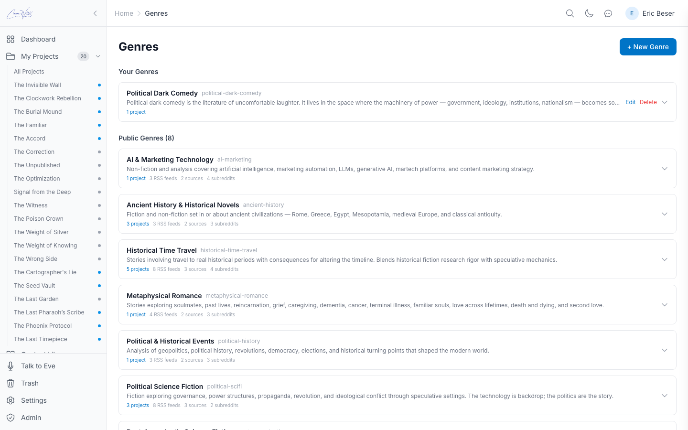

A genre is a **reusable creative template**. Every brainstorm and writing workflow reads the genre's writing guidelines, keyword bank, and source URLs to shape its output. Adding a new genre is the single highest-leverage thing you can do to make the system write the kind of book *you* want — far more impactful than tweaking individual brainstorm prompts.

The page has two sections:

### Public Genres Section

Read-only system genres that ship with the platform (e.g., *post-apocalyptic*, *political-scifi*, *historical-time-travel*, *metaphysical-romance*, *scifi-romance*). Anyone can use them in brainstorms and writes. You can't edit or delete these — if you want a variation, copy one of them into a custom genre and tweak from there.

### Custom Genres Section

Your private genres. Full CRUD.

- **+ New Genre** button (top right).
- Each card shows: name, slug, description, **feed count**, **project count** (live), edit and delete buttons.
- **Delete** is blocked if the genre is in use — a cascade dialog tells you which projects/content currently reference it. Reassign or delete those first.

### Walkthrough — creating a "Political Comedy" genre

We'll create a brand-new genre called **Political Comedy** to support a satirical-fiction line. Click **+ New Genre** in the top right of the genres page. The list view is replaced by the create form (`+ Back to Genres` link returns).

#### Empty form

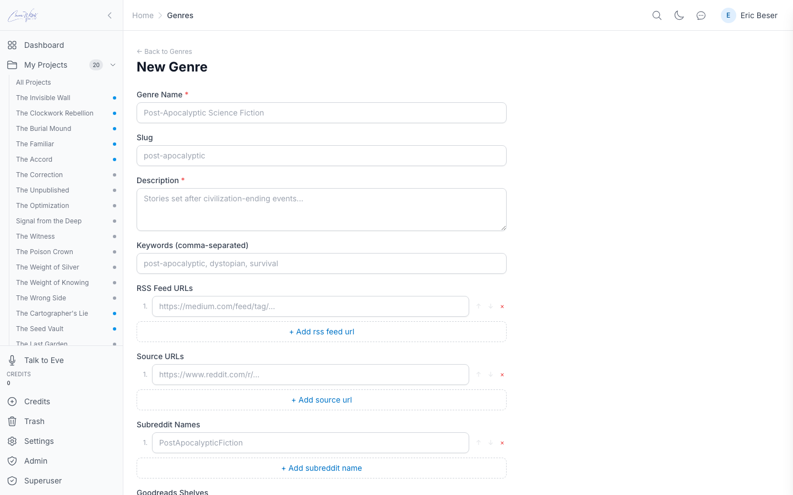

Every field except Slug auto-populates from defaults; Slug is generated from Name as you type.

#### Filled form — top half (identity + sources)

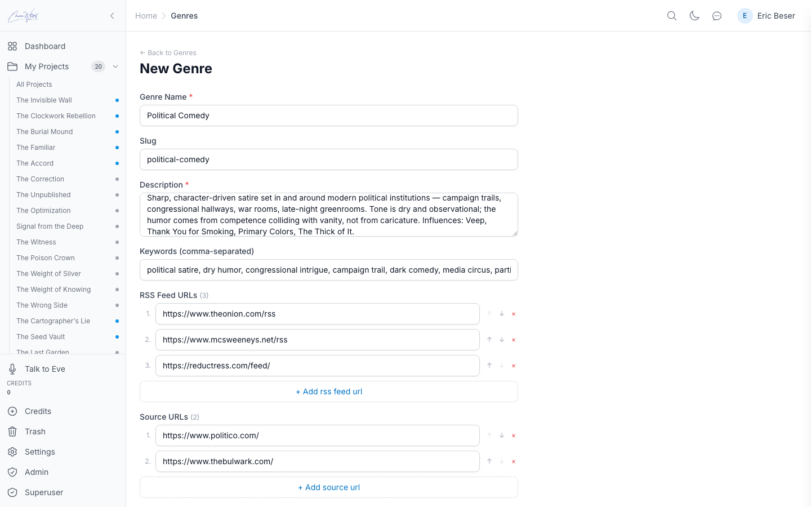

| Field | Required? | What to put here |
|---|---|---|
| **Genre Name** | ✅ | Display name as it'll appear in dropdowns. *Political Comedy.* Title-case is conventional. |
| **Slug** | optional (auto-generated) | URL-safe key derived from Name on first edit. *political-comedy.* Override only if you want a shorter alias (e.g., `polcom`) — must stay lowercase, hyphenated, no spaces. The slug is what brainstorm requests pass over the wire, so renaming a genre slug after projects exist will break their genre reference. |
| **Description** | ✅ | One paragraph. Tell the system what the genre **is** — tone, register, influences, what makes it different from adjacent genres. The brainstorm engine reads this to anchor outline tone. *Sharp, character-driven satire set in and around modern political institutions — campaign trails, congressional hallways, war rooms, late-night greenrooms. Tone is dry and observational; the humor comes from competence colliding with vanity, not from caricature. Influences: Veep, Thank You for Smoking, Primary Colors, The Thick of It.* |
| **Keywords (comma-separated)** | optional | A search-style list. Used by Perplexity research to seed discovery queries when the brainstorm needs reference material. Keep it tight (5–10 terms). For Political Comedy: *political satire, dry humor, congressional intrigue, campaign trail, dark comedy, media circus, partisan absurdity.* |
| **RSS Feed URLs** | optional, URL-validated | Discovery feeds. Each URL becomes a polled source for the **Newsletter Agent** ingestion pipeline (a later release — populating these now means the genre is ready when that ships). For Political Comedy, three example feeds: `https://www.theonion.com/rss`, `https://www.mcsweeneys.net/rss`, `https://reductress.com/feed/`. Click **+ Add rss feed url** to add another row; use the up/down arrows to reorder; the red × removes a row. Invalid URLs get a red border with an error tooltip. |

> **About RSS Feed URLs.** This is the field most people ask about. Today, the Workbench reads these only for context when researching a genre. In the upcoming **Newsletter Agent** release, the same URLs will become *inbound* feeds — the system will poll them on a schedule, dedupe items, and surface fresh discovery material into your library so you can cite or repurpose it. Populate these even if you don't plan to use the newsletter pipeline today; future-you will thank present-you.

#### Filled form — bottom half (sources + writing rules + activate)

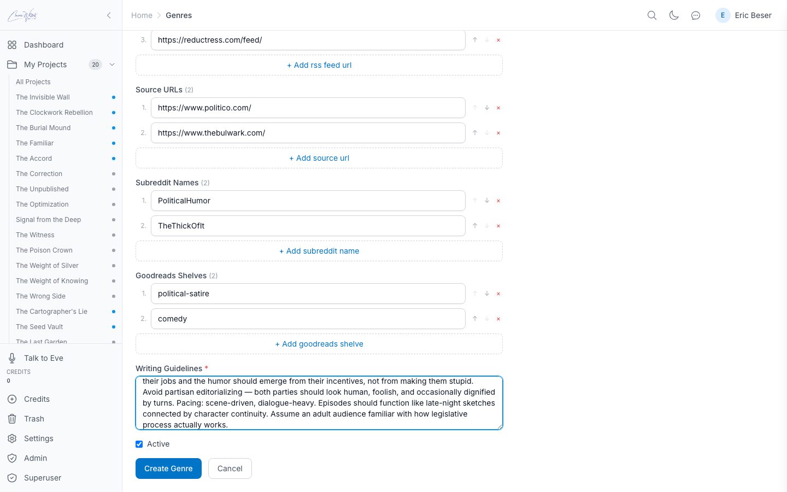

| Field | Required? | What to put here |
|---|---|---|
| **Source URLs** | optional | Article/site URLs the brainstorm and research workflows can quote or link to. For Political Comedy: `https://www.politico.com/`, `https://www.thebulwark.com/`. Same Add / reorder / delete UI as RSS Feed URLs. |
| **Subreddit Names** | optional | Bare subreddit names — no `r/` prefix, no full URL. *PoliticalHumor*, *TheThickOfIt*. Reddit ingestion (when wired) reads these as community signals. |
| **Goodreads Shelves** | optional | Goodreads shelf identifiers used to surface real-world examples and bestseller lists for this genre. *political-satire*, *comedy*. |
| **Writing Guidelines** | ✅ | The single most important field. This is appended to every prompt sent to Claude when writing in this genre. Use it to tell the AI **what to do and what to avoid**. Cover: tone, register, what makes the humor land, banned habits (e.g., "no caricature", "no partisan editorializing"), pacing rules, audience assumption. |
| **Active** (checkbox) | — | Defaults to checked. Uncheck to soft-disable a genre — it stays in the database but disappears from brainstorm/write dropdowns. Use this instead of deleting when projects depend on the genre but you want to retire it from new work. |

**Sample Writing Guidelines for *Political Comedy*:**

> Tone: dry, observational, professional. Avoid caricature — characters should be competent at their jobs and the humor should emerge from their incentives, not from making them stupid. Avoid partisan editorializing — both parties should look human, foolish, and occasionally dignified by turns. Pacing: scene-driven, dialogue-heavy. Episodes should function like late-night sketches connected by character continuity. Assume an adult audience familiar with how legislative process actually works.

#### Submitting

Click **Create Genre** at the bottom-left of the form. The genre saves and you're returned to the genres list with the new card visible in the **Custom Genres** section. The genre is immediately selectable in the Brainstorm form (§10), Write Chapter, Repurpose, and every other genre-aware workflow.

> **Editing later.** Click the pencil icon on the card to re-open the same form pre-filled. Changes apply to **future** brainstorms and writes — content already produced under the genre is unaffected.

---

## 13. Reference: Story Arcs

URL: **`/story-arcs`**

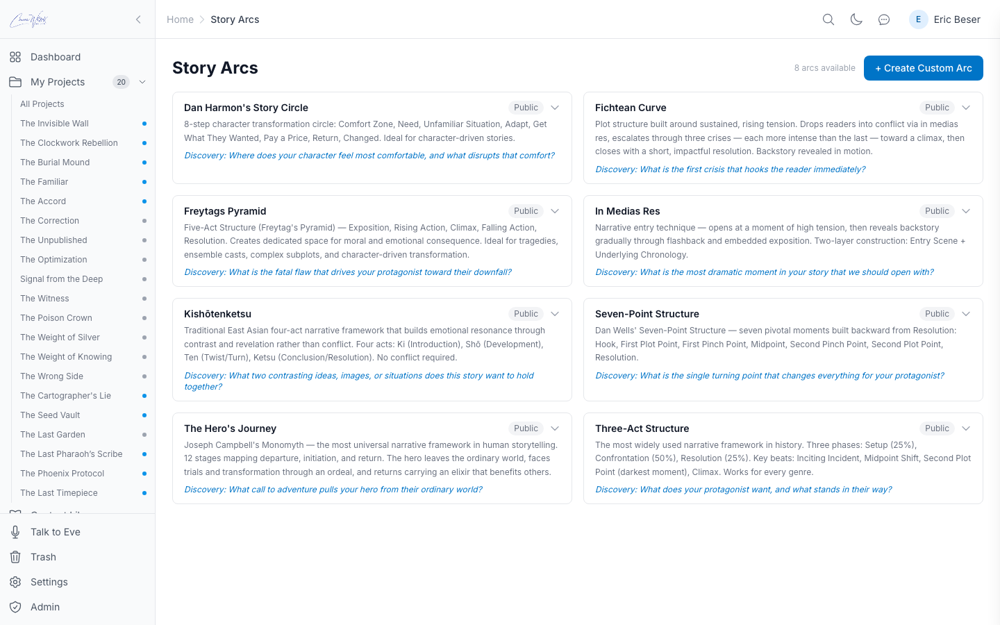

### Browser

A grid of story arcs with name, description, and discovery question. Public arcs are read-only; your custom arcs can be edited or deleted.

Built-in arcs include: Freytag's Pyramid, Three-Act Structure, Hero's Journey, Dan Harmon's Story Circle, In Medias Res, Seven-Point Structure, Kishōtenketsu, Fichtean Curve.

### + Create Custom Arc

Opens the Story Arc form. Fields: **Name**, **Description**, **Prompt text** (the long-form structural guidance), **Discovery question** (the question Eve asks before brainstorming with this arc).

---

## 14. Reference: Research

URL: **`/research`**

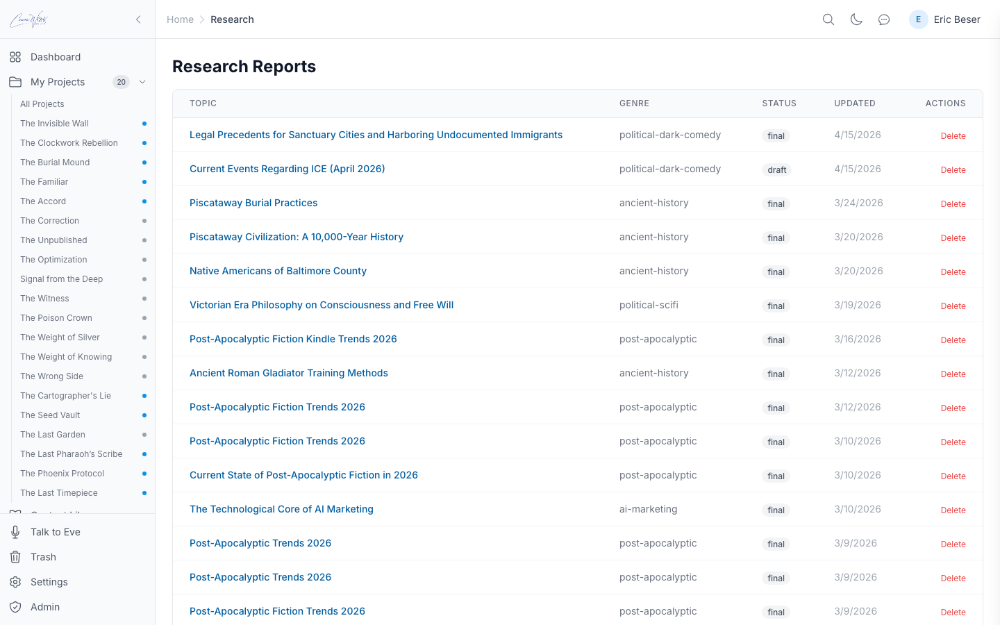

A paginated list of saved research reports. Columns: **Title**, **Genre**, **Word Count**, **Created**.

Click any row to open the **Research Detail** page (see next).

### Research Detail

URL: **`/research/:id`**

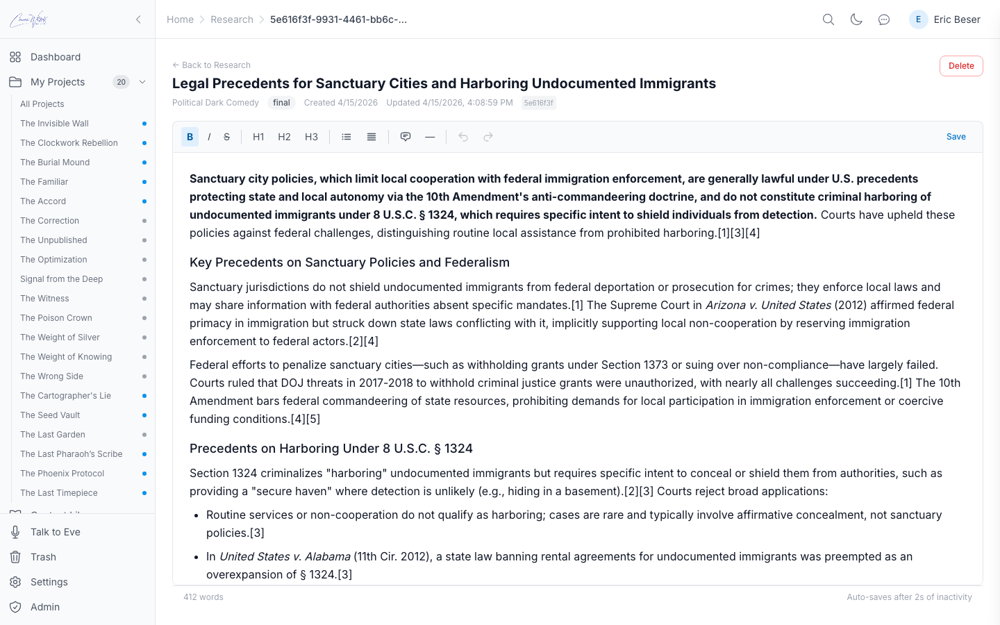

- Full TipTap editor with the report's content.
- Auto-save with debounce.
- **Delete** button with confirmation.

---

## 15. Reference: Sources

URL: **`/sources`**

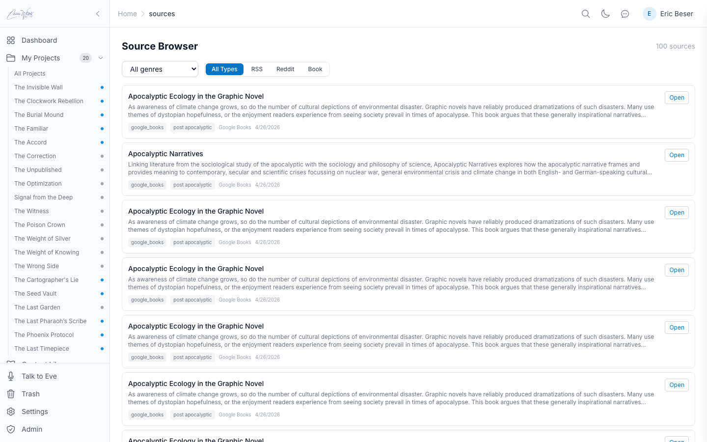

The browseable index of articles ingested via genre RSS feeds. Used as raw material for research and writing.

Filters: **Genre**, **Type**.

Each row: title, source URL (clickable), genre badge, scraped date.

---

## 16. Reference: Cost Tracking

URL: **`/cost`**

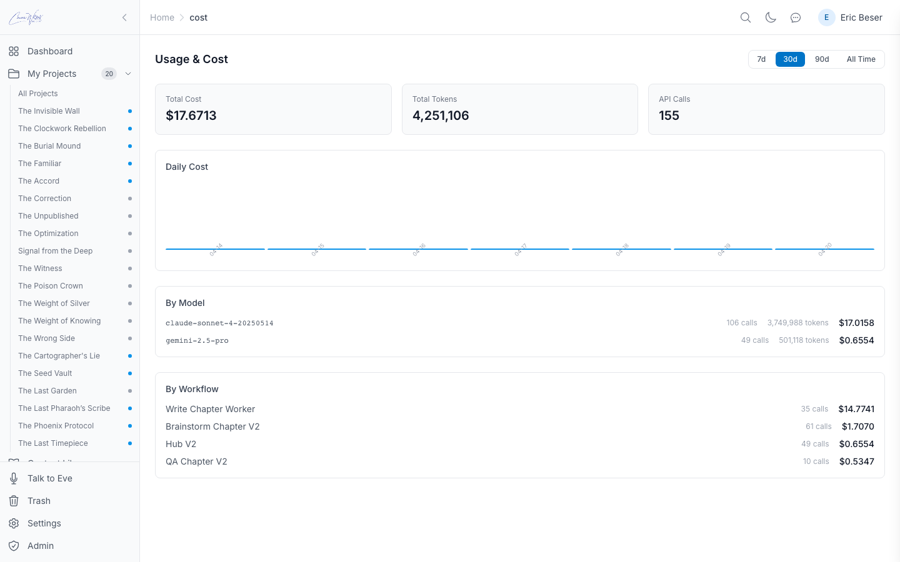

Tracks AI token usage and spend.

### Date-Range Filter

7 days / 30 days / 90 days / all time.

### Summary Cards

- **Total Cost** ($USD)
- **Total Tokens**
- **API Calls**

### Daily Cost Bar Chart

One bar per day in the selected range.

### Breakdowns

- **By Model** — Claude Sonnet, Claude Opus, GPT-4, Perplexity, Gemini, etc.
- **By Workflow** — Brainstorm Story, Write Chapter, Generate Cover Art, etc.

---

## 17. Trash & Restore

URL: **`/trash`**

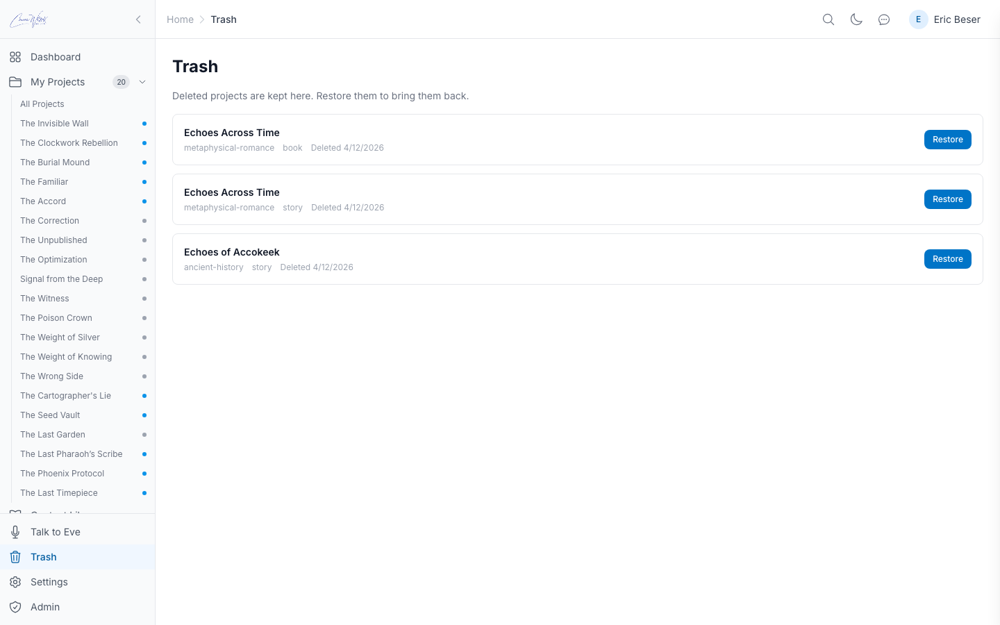

Soft-deleted items go here. They are kept for **30 days** before permanent deletion.

Tabs: **Projects**, **Chapters/Stories/Blogs/Newsletters**, **Research Reports**, **Story Bible Entries**.

Each row has:

- **Restore** — un-deletes the item.
- **Permanent delete** — removes immediately (with confirmation).

---

## 18. Settings

URL: **`/settings`**

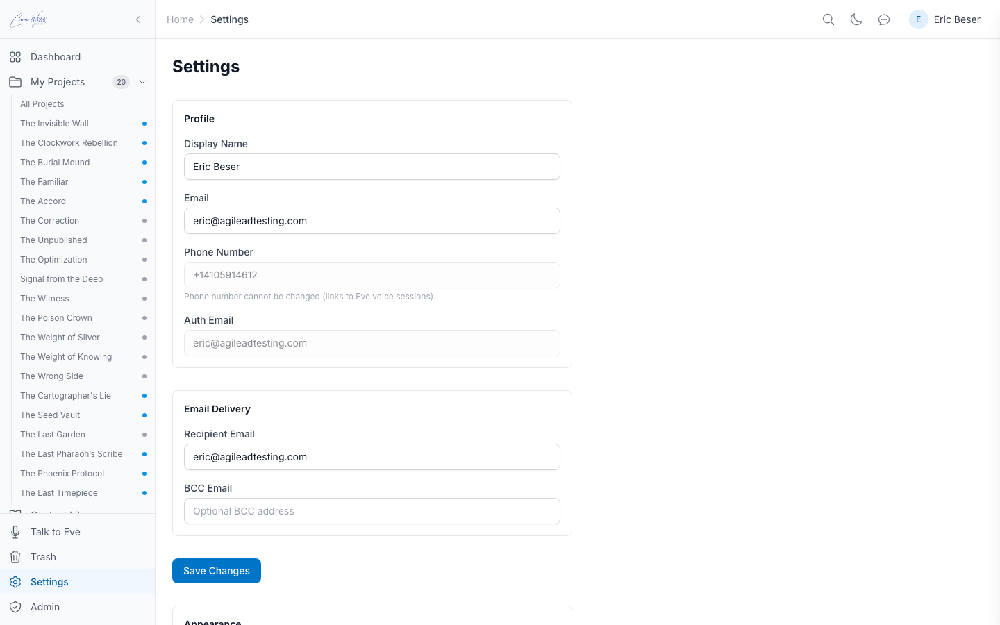

### Account

- **Display name** — editable.
- **Email** — read-only (managed by your sign-in account).
- **Phone (user_id)** — read-only.

### Password

- **Current password**, **new password**, **confirm new password**.
- Click **Update Password** — confirmation appears as a toast.

### Theme

Three options: **Light**, **Dark**, **System** (matches your OS preference). Selection is saved to localStorage and applied immediately.

### Help

- **Replay Tutorial** — re-runs the first-time onboarding tutorial.

### Danger Zone (bottom)

- **Delete Account** — permanently removes your account and all your content.
- Cascade impact is shown (counts of projects, chapters, etc).
- You must type the word **DELETE** in the confirmation field to proceed.
- After deletion, you are signed out and redirected to the login page.

---

## 19. Admin Panel (admin only)

URL: **`/admin`**

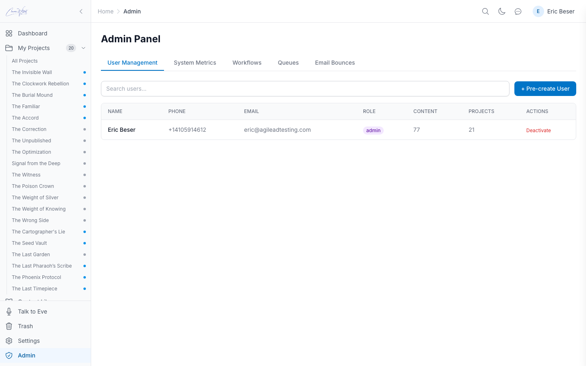

> **Heads up — this section applies only if you are a workspace administrator.** The **Admin** entry in the sidebar is hidden for regular writer accounts. If you don't see it, you can skip this section.

Visible only to admin users.

### Tab — User Management

- Search / filter users.
- **+ Create User** with role assignment.
- Click a role badge to change it inline (admin / editor / viewer).
- **Deactivate** sets a user's role to viewer (with confirmation).
- Each row shows the user's content count and project count.

### Tab — System Metrics

- 6 summary cards: Users, Projects, Content, Research, Genres, Story Arcs.
- **Content by Status** (color icons).
- **Content by Type** breakdown.

### Tab — Workflows

- Live workflow execution table with status badges, duration, and start time.
- Auto-refreshes every 30 seconds.

---

## 20. Chat with Eve (the text-based chat drawer)

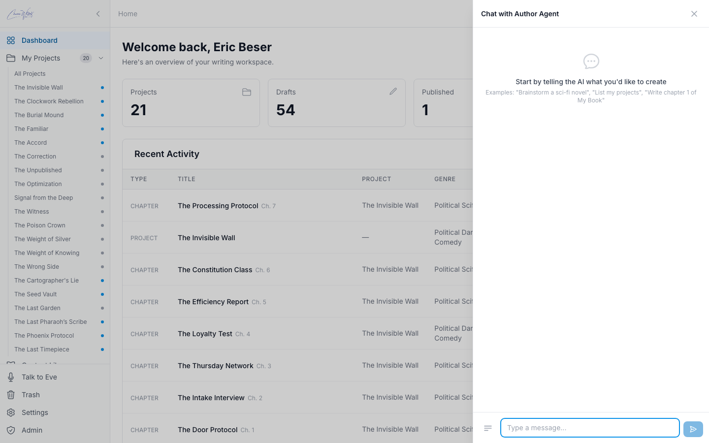

Opens from the **chat icon** in the top bar (right side, between the search and theme toggle).

This is the **text version of Eve.** She shares the same brain, tools, and memory as the voice agent in §21 — both surfaces talk to the same writing engine and read/write the same projects, outlines, library, and story bibles. **Anything you can say to voice Eve, you can type to chat Eve.** The full command reference is in §22.

### When to use chat vs voice

| Use chat when… | Use voice when… |
|---|---|
| You need an exact title, quote, or URL pasted in (voice transcription is fuzzy) | You're hands-free or pacing |
| You're in a quiet space (open office, library, late at night) | You want to think out loud or revise mid-sentence |
| You want a written transcript to copy from later | You want Eve to read short results aloud |
| You want one-click **Quick Commands** to scaffold a request | You want a phone callback to discuss a chapter live |

You can also mix them — start a brainstorm in chat (paste your reference URL precisely), then ask voice Eve to "pull up that outline" once it lands. Both surfaces see the same history.

### Anatomy of the drawer

A resizable side panel anchored to the right edge of the window. Drag the **left edge** to resize anywhere from 360 px (cozy) to 800 px (transcript-comfortable).

#### Message History (top)

- **Persistent across navigation** — stored in `localStorage` per browser. Last 100 messages.
- Each message shows a **timestamp** on hover.
- **You** messages are right-aligned with a brand-tinted background; **Eve** messages are left-aligned with a neutral background.
- **Animated typing indicator** (three bouncing dots) appears while a tool is running. Long tools (brainstorm, write chapter) show this for 30–120 s — that's normal.
- **Clear history** button (top of drawer) wipes localStorage. Use it before sharing your screen if you don't want previous prompts visible.
- Scrolling up loads earlier messages from the same session. Reloading the page keeps the session.

#### Input (bottom)

- Auto-growing textarea — paste multi-line concepts, character lists, even an entire chapter.
- **Enter** sends. **Shift + Enter** for newline.
- The send button (paper-plane icon) lights up only when the input has non-whitespace content.

#### Quick Commands Panel

A grid of one-click prompt scaffolds that pre-populate the input box (so you can edit before sending). Standard commands:

- **List my projects**
- **Brainstorm a book…**
- **Write a chapter…**
- **Research a topic…**
- **Generate cover art…**
- **Repurpose for social…**
- **List my outlines**
- **Approve content…**

When you're inside a project workspace (`/projects/<id>`), **context-aware commands** appear in the same panel, pre-filled with the current project name:

- **Write next chapter of *"[Project Name]"***
- **Generate cover art for *"[Project Name]"***
- **Repurpose *"[Project Name]"* for social**

The Quick Commands are scaffolds, not magic — clicking one drops the template into the input box and you finish the sentence. *"Brainstorm a book…"* expands to a starter prompt; you complete it with the topic, genre, and any constraints, then hit Enter.

### Sample interactions

**Synchronous — list operations return inline:**

> **You:** List my outlines  
> **Eve:** Here are your 12 outlines:  
> 1. *The Invisible Wall* — post-apocalyptic, 14 chapters  
> 2. *The Burial Mound* — historical-time-travel, 11 chapters  
> 3. *Term Limits* — political-comedy, 12 chapters  
> …

**Asynchronous — write/brainstorm/repurpose return an ack, results land later:**

> **You:** Brainstorm a book in political-comedy. Premise: a stand-up comedian gets appointed to fill a senate seat after her father dies, and discovers the late senator was blackmailing the Speaker of the House.  
> **Eve:** Command sent — results will appear in your Content Library.  
> *(60–120 seconds later)*  
> **🔔 Toast notification** (bottom-right): *"Outline ready for Term Limits"*

The Content Library refreshes automatically; the new outline is also emailed to you.

### How async operations work under the hood

When you ask Eve to **write**, **brainstorm**, **repurpose**, or **generate art**, the writing engine accepts the request, validates it, and immediately returns an acknowledgement. The actual heavy work runs on a background queue — research, drafting, image generation, file delivery — and emits a **toast notification** in the bottom-right when complete.

**Sync operations** (list, retrieve, approve, list outlines, list versions, etc.) skip the queue and return inline because their data is already in the database.

If a long-running task fails (rate limit, validation error), you'll see a red toast with the failure reason, and a corresponding error row appears in **Reference → Cost Tracking** (§16).

---

## 21. Eve — The Voice Agent

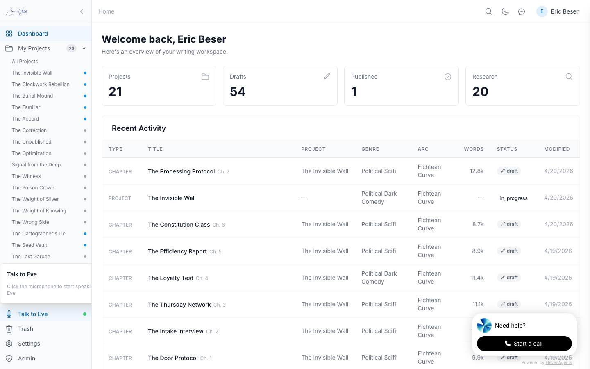

Eve is the voice surface. She lives at the **bottom of the sidebar** as the **Talk to Eve** button, and she's the same agent as Chat with Eve (§20) — same tools, same memory, same writing engine. The only difference is the modality.

### What Eve is good at (and what she isn't)

**Use Eve when:**

- You're hands-free (driving, walking, cooking) and want to keep working.
- You want to brainstorm out loud — Eve handles half-finished thoughts and self-corrections gracefully.
- You want short answers spoken back ("how many chapters does *Term Limits* have?", "what genres do I have?").
- You want to **review** content live by phone (see "When Eve Calls You Back" below).
- You want to discuss revisions to an outline or chapter conversationally before committing them.

**Use chat (§20) instead when:**

- You need to paste a precise title, URL, or quote — voice transcription will mangle it.
- You're in a noisy or quiet-required space.
- The task is purely list-driven and you'd rather scan than listen.

### What happens when you click "Talk to Eve"

A popover appears with the **ElevenLabs voice widget** embedded. The widget:

1. **Requests microphone access** (first time only — the browser remembers thereafter).
2. Shows a brief **"Connecting"** state while it opens the WebRTC session.
3. Switches to a **listening orb** with a green pulse dot in the sidebar when ready.

The first call from a new device may take 3–5 seconds to connect. Subsequent calls in the same browser session are near-instant.

> **Microphone troubleshooting.** If nothing happens after the first click, check the browser address-bar mic permission. On macOS, also confirm the browser has system-level mic access (System Settings → Privacy & Security → Microphone). On Chrome, an explicit permission prompt appears the first time and never again — you have to revoke and re-grant from `chrome://settings/content/microphone` if you accidentally denied it.

### How to speak to Eve

Just **talk normally.** Eve handles:

- Casual phrasing — *"Hey Eve, can you write me a chapter about JoJo's first floor speech?"*
- Self-correction — *"Brainstorm a — actually wait, first list my projects."* She'll do the second thing.
- Multi-step requests — *"Brainstorm a book in political comedy and then research congressional procedural rules."* She'll execute them sequentially.
- Conversational clarification — *"the one we did yesterday about the comedian"* will resolve via context if you've referenced it earlier in the same call.

Eve will:

- **Confirm before starting long tasks** — *"Got it. I'm going to brainstorm a 12-chapter outline in political comedy. This will take about a minute and you'll get an email when it's done. Anything else while we wait?"*
- **Tell you when results are ready** — both verbally and via the same toast notification chat sees.
- **Read short results out loud** — lists, confirmations, single-line answers.
- **For long content** (chapters, full drafts), tell you to check email and the Content Library — she won't try to read 5,000 words back at you.

### When Eve calls you back (the callback pattern)

Some operations trigger Eve to **call your phone**. Examples:

- *"Pull up chapter 3 of Term Limits so we can review it."*
- *"Let's talk through the outline for The Invisible Wall."*
- *"Read me JoJo's character bible."*

When you ask Eve for an interactive review, the system loads the content into her knowledge base, then dials the phone number on your account (E.164 format from Settings). Your phone rings; you answer; Eve picks up where you left off and you can revise verbally.

**While the web widget is active**, the system suppresses the phone callback automatically — instead, the content is loaded into the open widget session and refreshed in the UI. You'll see a toast: *"Eve has loaded [title]."* Close the widget to switch back to the phone-callback path.

### Closing Eve

- **Click Talk to Eve again** to close the popover.
- **Click anywhere outside the popover** — same effect.
- Closing the popover ends the voice session and the orb returns to its idle state.

The ElevenLabs widget keeps a per-session conversation; if you close and re-open within a few seconds, you may pick up where you left off, but for cleanliness it's better to treat each open as a fresh session and re-state the project context if relevant.

---

## 22. Eve Commands — Full Reference (Voice **and** Chat with Eve)

> **Important:** The same commands work two ways:
> 1. **Spoken aloud** to Eve via the voice widget (sidebar → **Talk to Eve**), or
> 2. **Typed** into the **Chat with Eve** drawer (top-bar chat icon).
>
> Anything in the tables below can be typed exactly as written — both interfaces drive the **same writing engine**. Use voice when you're hands-free; use Chat with Eve when you want a written transcript, copy-pasteable titles, or quiet/discreet work.

### Project & Outline

| Say... | What happens |
|---|---|
| "Brainstorm a book called *[title]* in *[genre]*" | Generates an outline, saves it, emails it. |
| "Brainstorm a book using Hero's Journey" | Eve asks the arc's discovery question first, then brainstorms. |
| "Add more chapters to *[title]*" | Re-brainstorms with updated chapter count. |
| "Make Margaret 50 years old in *[title]*" | Calls `edit_outline` for a small targeted change. |
| "Rename chapter 5 to *[new title]*" | `edit_outline`. |
| "List my projects" | Returns all projects. |
| "List all outlines" | Returns every project that has an outline. |
| "List chapter outlines for *[project]*" | Returns chapters with detailed sub-chapter outlines. |
| "Show me outline 3" / "the first one" | Numbered list selection from the most recent list. |
| "Revert outline for *[title]* to version 2" | Restores a previous outline version. |

### Chapter Writing

| Say... | What happens |
|---|---|
| "Write chapter 3 of *[title]*" | First runs `brainstorm_chapter` (sub-chapter outline), emails for review. |
| "Write the prologue for *[title]*" | Same flow with `chapter_number='Prologue'`. |
| "Write the epilogue for *[title]*" | Same flow with `chapter_number='Epilogue'`. |
| "Outline chapter 4 of *[title]*" | Just generates the chapter outline, no writing. |
| "Q/A chapter 3 of *[title]*" | Runs the 9-check consistency report on an existing chapter. |
| "Revise chapter 3 to *[change]*" | Re-writes the chapter with your guidance. |

### Other Writing

| Say... | What happens |
|---|---|
| "Write a blog post about *[topic]*" | Generates blog post, saves to library, emails. |
| "Write a newsletter about *[topic]*" | Newsletter with citations, saved, emailed. |
| "Write a short story about *[premise]*" | Short story, saved, emailed. |
| "Brainstorm a short story called *[title]*" | Outline only — note "brainstorm" always means outline, never the actual story. |

### Research

| Say... | What happens |
|---|---|
| "Research *[topic]*" | Perplexity research → saves report → emails. |
| "Research *[topic]* for *[project]*" | Same, but tags with the project's genre. |
| "Email me the research on *[topic]*" | Looks up saved report and emails it. |
| "Update my research on *[topic]* with *[new info]*" | Retrieves the report and revises it. |

### Library Operations

| Say... | What happens |
|---|---|
| "Approve *[title]*" | Sets content status to approved. |
| "Publish *[title]*" | Sets status to published, snapshots a version. |
| "Reject *[title]*" | Sets status to rejected. |
| "Delete *[title]*" | Soft-delete (moves to Trash). |
| "Undelete *[title]*" / "Restore *[title]*" | Restores from Trash. |
| "Show deleted items" / "trash" | Lists soft-deleted content. |
| "Email me the chapter *[title]*" | Sends the chapter as an email. |
| "Email me the outline for *[project]*" | Sends the outline. |

### Visual & Distribution

| Say... | What happens |
|---|---|
| "Generate cover art for *[project]*" | Nano Banana generates the cover image, saves to the Art tab, and emails it. |
| "Repurpose *[title]* to social media" | Generates Twitter/LinkedIn/Instagram posts. |

### Story Bible

| Say... | What happens |
|---|---|
| "Show the story bible for *[project]*" | Lists all bible entries. |
| "Add a character to *[project]*: *[details]*" | Adds an entry of type `character`. |
| "Update *[character]* in *[project]*: *[change]*" | Updates the entry. |

### Kindle Publishing

| Say... | What happens |
|---|---|
| "Publish *[project]*" / "Format for Kindle" | Eve asks which page size, then formats the .docx and emails it. |
| "Publish *[project]* in 6 by 9" | Skips the page-size question. |

### Eve Callback (advanced)

| Say... | What happens |
|---|---|
| "Pull up chapter 3 of *[project]* and let's review" | Loads the chapter into Eve's knowledge base; if you're on the web, you get a toast — if you're on phone, Eve calls you back. |
| "Let's brainstorm chapter 5 of *[project]*" | Same flow with `callback_mode=brainstorm`. |

### Tips for Talking to Eve

- **Be specific** with project titles. "The book about the doors" is harder than "The Invisible Wall."
- **One major task at a time** unless you explicitly chain them ("First brainstorm, then research the setting").
- **Numbered lists** — when Eve reads back a list, you can reply "the first one" or "show me 3" instead of repeating the title.
- **If Eve seems stuck**, say "stop" or close the popover and try again. The agent has a 3-iteration cap, so it won't loop forever.

---

## 23. Keyboard Shortcuts

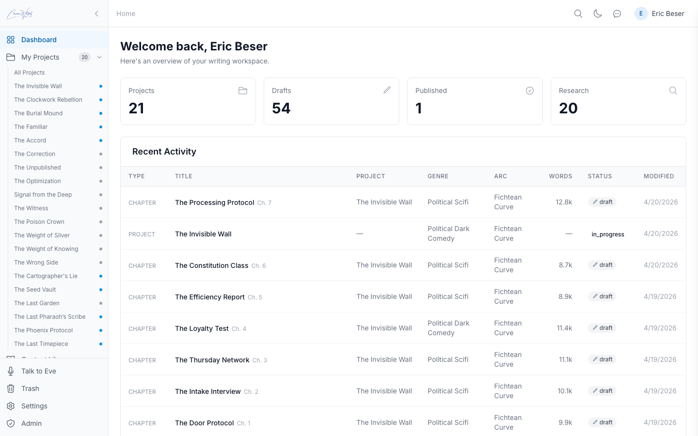

| Shortcut | Action |
|---|---|
| **Cmd/Ctrl + K** | Focus global search |
| **Cmd/Ctrl + S** | Force-save the current content (editor) |
| **Esc** | Close any open dialog or popover |
| **Tab** + **Enter** | Navigate and activate any clickable row |
| **Shift + Enter** | New line in chat input (Enter sends) |
| Arrow keys + **Enter** | Navigate version history list |

---

## 24. Troubleshooting

### "Failed to fetch dynamically imported module" / blank page after a deploy

The app auto-reloads to pick up the new version. If you still see this, hard-refresh: **Cmd + Shift + R** (Mac) or **Ctrl + Shift + R** (Windows).

### Eve doesn't connect

1. Check that you've allowed **microphone access** in your browser address bar.
2. Refresh the page and click **Talk to Eve** again.
3. If you still see "Connecting" forever, close the popover and try a different browser.

### A new chapter / outline didn't appear

Most writing tasks take **30–90 seconds**. If it's been longer than 5 minutes:

1. Check your **email** — most workflows email the result.
2. Check the **Content Library** with the right filter.
3. Re-issue the request to Eve or the chat. The system de-duplicates if it sees the same chapter is already being worked on.

### "Something went wrong" error page

Click **Reload Page**. If it persists, go to **Settings → Help → Replay Tutorial** to confirm your account is still active, or contact support.

### My genre doesn't appear in the dropdown

You may have deleted it. Check **Trash → Genres**. If it's gone, recreate it via **Reference → Genres → + New Genre**.

### A chapter is editable but won't save

The auto-save indicator at the top right shows the save state. If it stays on "Saving..." for more than 30 seconds, your network may have dropped. Press **Cmd/Ctrl + S** to force a retry.

---

## 25. Account, Billing & Account Deletion

### Switching Accounts

Sign out from the **Settings** page, then sign in as another user. Your data is fully isolated by `user_id`.

### Account Deletion

Settings → **Danger Zone** → **Delete Account** → type **DELETE** → confirm.

This permanently removes:

- Your user record.
- All your projects, chapters, stories, blogs, newsletters.
- All your research reports.
- All your story bible entries.
- All your generated images and social posts.
- All your custom genres and story arcs.

This is **irreversible**. Soft-deleted items in Trash are also removed.

### Need Support?

Contact your administrator. Production support is provided by Course Worx Media.

---

*This manual covers only features available in the current production release. New capabilities — including the upcoming Newsletter Agent — will be documented in subsequent updates.*
